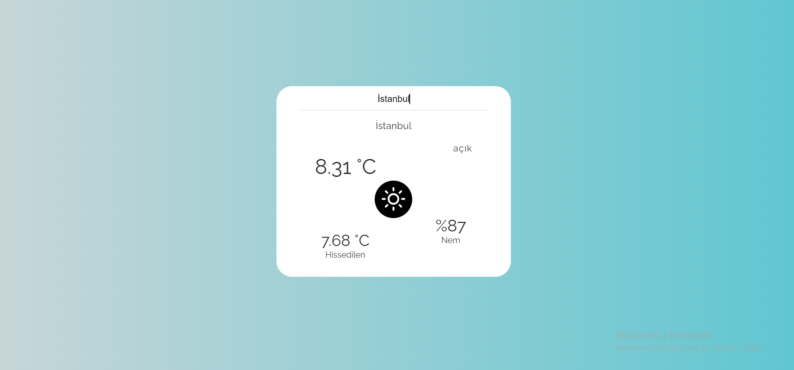

# Weather App

#### Weather App bir hava durumu uygulamsıdır. İsmi giriilen Şehre ait anlık hava durumu bilgisi ve diğer parametreleri verir.
 

## Metotlar ve Teknolojiler

#### Uygulama React kütüphanesi ile yazılmıştır. Uygulamadaki hava durumu iconlarını "React-Icons" kütüphanesinden alınmıştır. İlk defa burda kullandığım React-Icons Kütüphanesi, geniş icon çeşitliliği ve sytling'nin kolay olması açısından işimi oldukça kolaylaştırmıştır.
#### Uygulama inputa girilen şehir ismine göre "api.openweathermap" apisne istek yaparak aldığı verileri ekrana basması ile çalışır.
 

  

#### Inputa şehir ismini girdikten sonra "Enter"'a bastığımızda bize istenilen şehrini hava durumu bilgileri ekrana getirilir.
 
